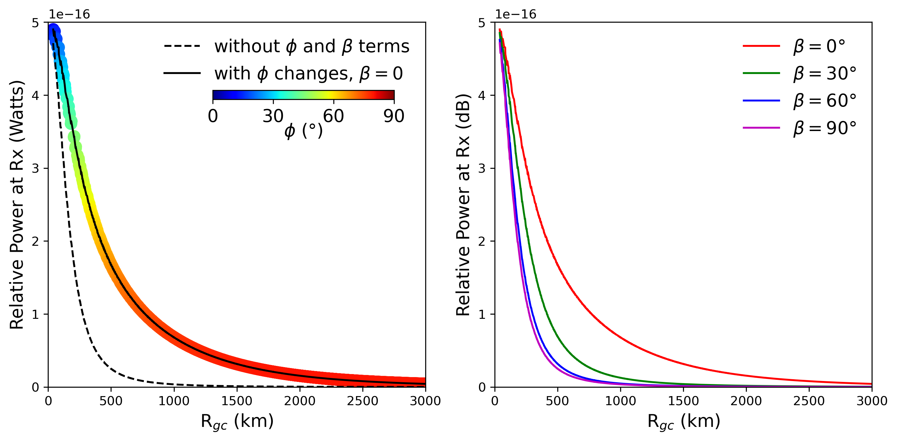
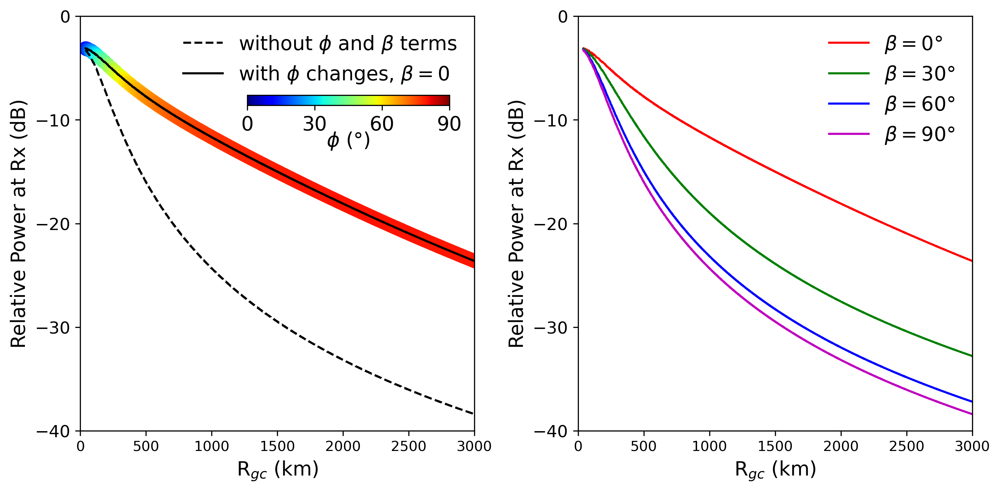

# Meteor Scatter QSO Party Research Questions and Objectives

**Objective:** Generate research-worthy data resulting from HF and VHF meter meteor scatter operations. The data will be used by the research community to answer science questions such as:

## Primary Research Questions
*These are questions that we plan to have closure on.*
1. What factors influence meteor scatter propagation?
   - What are the similarities and differences between HF and VHF meteor scatter propagation?
   - How does propagation change between between the Perseid and Geminid meteor showers due to their different speeds and radiant geometries?
   - How does propagation change between the various sporadic sources and minor showers with their different speeds and radiant geometries?
   - How does propagation change with radiant geometries, trail direction, meteoroid size, and speed?
2. What is the typical duration of useful meteor scatter propagation?
   - How does this duration vary with radio frequency, transmitter–receiver distance, and meteor velocity?
3. What is the minimum size of an amateur radio station needed to work meteor scatter operations?
   - How does this minimum station size vary between HF and VHF bands?
4. How can meteor scatter communication be distinguished from other propagation modes?
   - What percentage of reported meteor scatter QSOs are actually meteor scatter?
   - What percentage are due to other modes (e.g., tropospheric, F-layer, E-layer, auroral)?
5. How do optical and radar meteor observations compare with amateur radio observations?

-----
Expressions for the power seen by the receiver $P_R$ (Watts) and echo duration $T$ (sec) are as follows,

$$ P_R \space \propto \space \frac{\lambda^3}{(R_1 R_2)(R_1 + R_2)(1 - \sin^2 \phi \space \cos^2 \beta)} $$  

$$ T \space \propto \space \lambda^2 \sec^2 \phi $$  

**Where:** 
$\lambda$ = radio wave wavelength,  
$R_1$ = distance between meteor trail and transmitter,  
$R_2$ = distance between meteor trail and receiver,  
$\phi$ = half of the angle between the R1 and R2 lines,  
$\beta$ = angle between meteor trail and the intersection line of the tangent plane and plane of propagation 

The equations show that the farther apart the transmitter and receiver are, the more power the meteor trail reflects, and the longer the echo lasts. However, at some point, the signal loss from the large distance (the terms involving $R_1$ and $R_2$) becomes too strong and cancels out the benefit of increasing the distance and angle $\phi$. Still, for a while (depending on the transmitter power), this setup has advantage over the backscatter. Therefore, placing the transmitter and receiver several hundred kilometers apart allows us to detect fainter and higher meteors than if both were in the same location.

<table>
  <tr>
    <td align="center" width="50%">
      
    </td>
    <td align="center" width="50%">
      
    </td>
  </tr>
</table>

<em>Figure 1. Received power and geometry effects in bistatic meteor scatter. Top and bottom panels shows received power variations in the linear and dB scales. Left panel illustrates detection range advantages for wider transmitter-receiver separations. Right panel depicts the effect of meteor geometry w.r.t. propagation plane on the received power.</em>

<table>
  <tr>
    <td align="center" width="50%">
       
    </td>
    <td align="center" width="50%">
       
    </td>
  </tr>
</table>

<em>Figure 2. Metoer sctatter power and decay time changes with frequency/wavelegth of radio commucation.</em>

Reference:  
   
McKinley, Donald William Robert. "Meteor science and engineering." New York (1961).  
Some Notes and Equations for Forward Scatter compiled by James Richardson https://amsmeteors.org/radio/scatter_notes.txt

   
----
